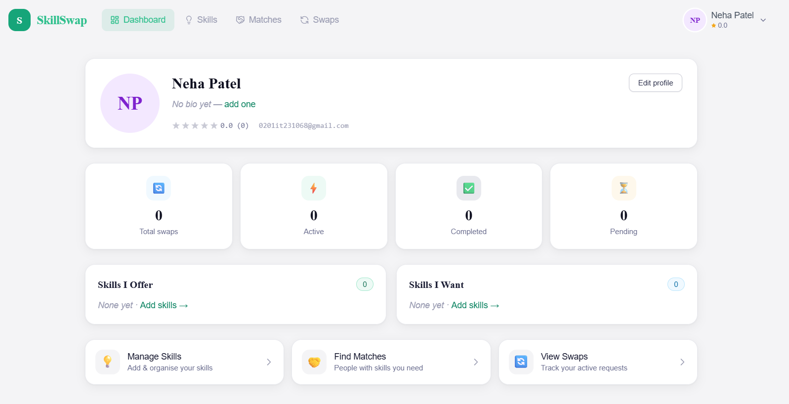
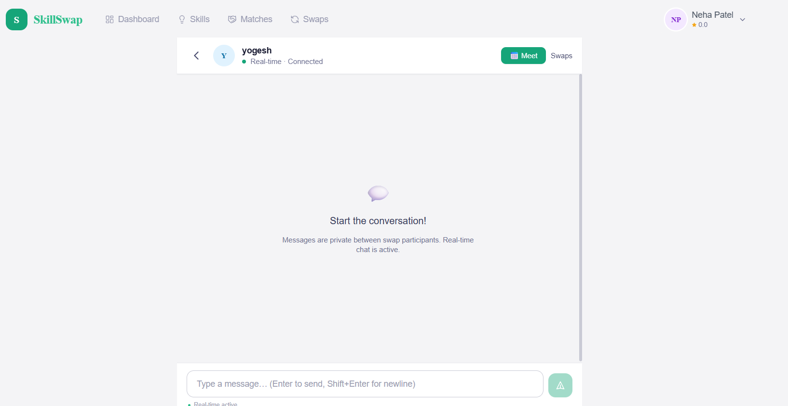
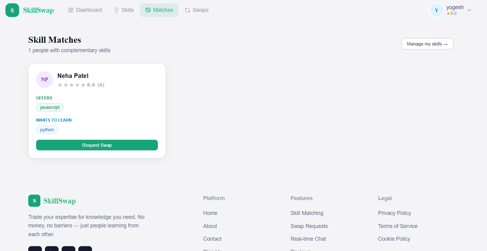

# 🚀 SkillSwap Platform

A MERN-Stack web application that enables users to **exchange skills with each other** through smart matching, real-time chat, and collaborative learning.

---

## 📸 Preview

  
  
  

---

## 🌟 Features

* 🔐 **Authentication System**

  * Register / Login
  * Forgot & Reset Password (Nodemailer)

* 👤 **User Profiles**

  * Add skills offered & wanted
  * Profile customization

* 🔄 **Smart Skill Matching**

  * Find users with matching skills
  * Discover relevant swap opportunities

* 📩 **Swap Requests**

  * Send / Accept / Reject swap requests
  * Track swap status

* 💬 **Real-time Chat**

  * Socket.io based messaging
  * Typing indicators
  * Instant communication

* 🎥 **Meeting Integration**

  * Generate Google Meet links for sessions

* ⭐ **Review System**

  * Rate users after swap completion
  * Feedback and trust system

* 📱 **Responsive UI**

  * Built using Tailwind CSS
  * Fully responsive across devices

---

## 🛠️ Tech Stack

### Frontend

* React.js
* Tailwind CSS
* React Router

### Backend

* Node.js
* Express.js

### Database

* MongoDB (MongoDB Atlas for production)

### Real-time

* Socket.io

### Email Service

* Nodemailer

---

## ⚙️ Installation & Setup

### 🔹 Clone the Repository

git clone https://github.com/nehap2110/skill-swap-platform
cd skill-swap-platform

---

### 🔹 Backend Setup

cd skill-swap-backend
npm install

Create `.env` file:

PORT=5000
MONGO_URI=your_mongodb_atlas_url
JWT_SECRET=your_secret_key

EMAIL_HOST=smtp.gmail.com
EMAIL_PORT=587
EMAIL_USER=your_email@gmail.com
EMAIL_PASS=your_app_password
EMAIL_FROM="SkillSwap <noreply@skillswap.com>"

CLIENT_URL=http://localhost:3000
RESET_TOKEN_EXPIRES_MINUTES=10

Run backend:

npm run dev

---

### 🔹 Frontend Setup

cd skill-swap-frontend
npm install
npm run dev

---

## ▶️ Run Locally

* Frontend → http://localhost:3000
* Backend → http://localhost:5000

---

## 🌐 Deployment

### Frontend

* Deploy using **Vercel**

### Backend

* Deploy using **Render / Railway**

### Database

* Use **MongoDB Atlas**

---

## 🚀 Future Improvements

* 📎 File & image sharing in chat
* 🔔 Notification system
* 📊 Better matching algorithm
* 📹 Built-in video calling (WebRTC)
* 🌍 Multi-language support

---

## 🤝 Contributing

Contributions are welcome! Feel free to fork the repo and submit a pull request.

---
## 👩‍💻 Author

**Neha Patel**
MERN Stack Developer 🚀

---

⭐ If you like this project, don’t forget to star the repository!
